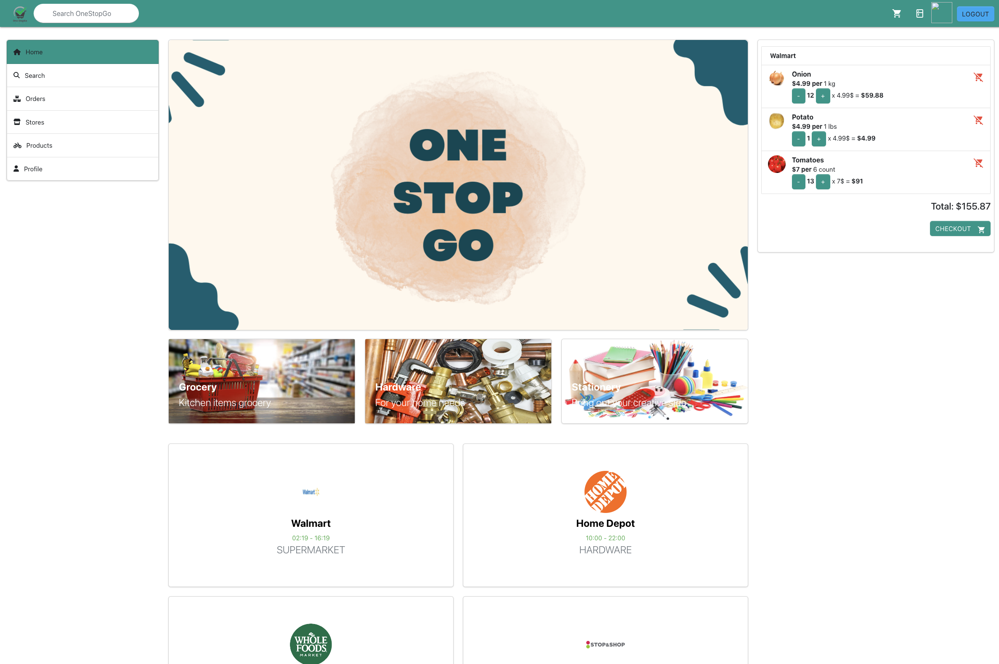

# Project Web Development - CS5610 - Team 34

## Team members
| Name                         | Section            | Email                         |
|------------------------------|--------------------|-------------------------------|
| Anantha Sashi Sekhar Karedla | CS5610.11744       | karedla.a@northeastern.edu    |
| Anuj Potdar                  | CS5610.20040       | potdar.a@northeastern.edu     |
| Mitali Ghotgalkar            | CS5610.20040       | ghotgalkar.m@northeastern.edu |
| Sujeet Kumar Gandhi          | CS5610.20040       | gandhi.su@northeastern.edu    |

## OneStopGO
## Problem Statement
**A single shot multi-store e-commerce website, that allows the user to place one order**

Please visit [here](https://docs.google.com/spreadsheets/d/1SwVI6TtURl8vidpJ_8WPqRb-dHObg3PTZcbRmgvBrR4/edit#gid=0) to view the detailed task list of the product.

## Frontend
* [App deployment link- Frontend](http://onestopgo.eastus.cloudapp.azure.com:8080/) 
* [Frontend Readme](./frontend/onestopgo/README.md)

## Backend
* [Server deployment link](http://onestopgo.eastus.cloudapp.azure.com:8080/)
* [Backend Readme](./backend/onestopgo/README.md)

