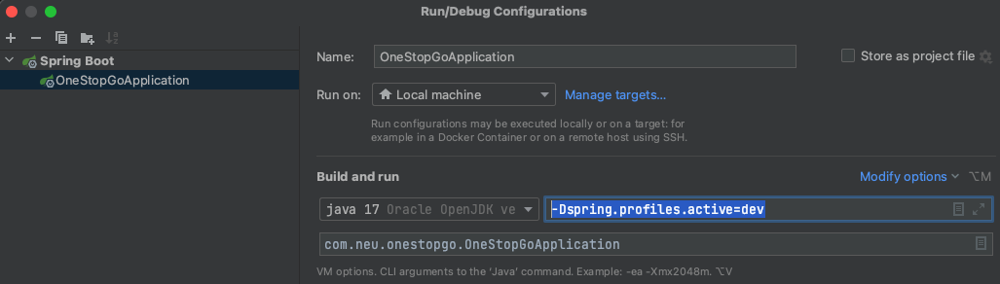

# [OneStopGo Backend](http://onestopgo.eastus.cloudapp.azure.com:8080/)

## Technologies Used
* Java
* Springboot
* Hibernate

## Requirements

We have compiled the backend code in a jar.
Make sure you have Java 11 installed. Rest all dependencies have been bundled in the jar.

### How to run the JAR:-
* Download the JAR : [download](https://github.com/sujeet-gandhi/web-dev-project/raw/local-jar/backend/onestopgo/local-jar/local-jar.jar)
* `java -jar -Dspring.profiles.active=dev -Dserver.port=8080 local-jar.jar`

### How to run using code clone:
* Clone the repo.
* Add `-Dspring.profiles.active=dev` to the edit configuration on IntelliJ Idea

* Add the environment variable using: `export REACT_APP_ONESTOPGO_API_BASE="http://localhost:8080`
* Run the code
* Navigate to `http://localhost:8080/api/v1/home`

