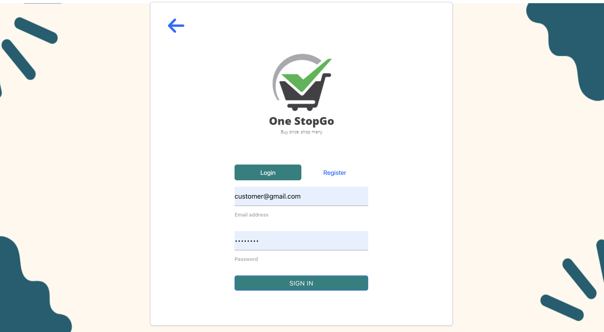
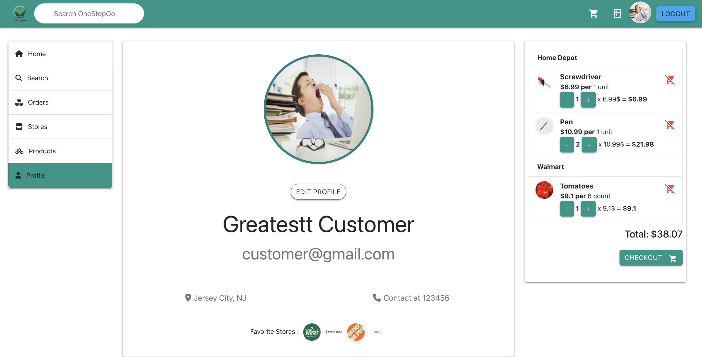
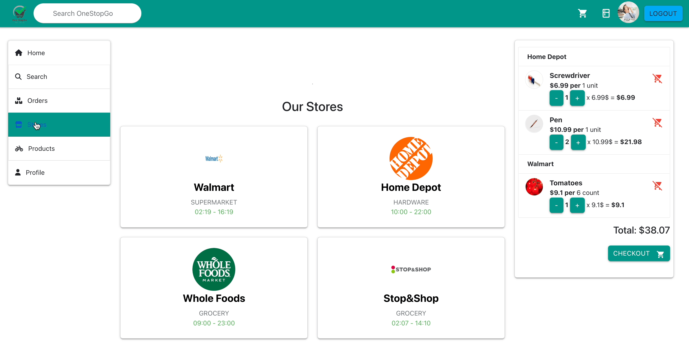
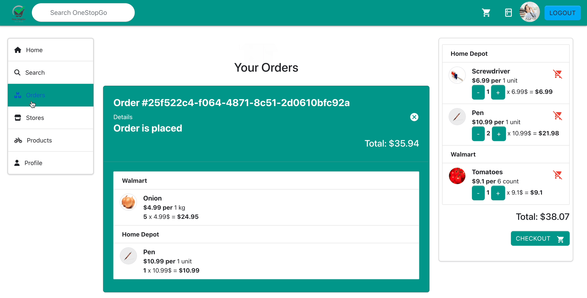

# [OneStopGo - Frontend](http://onestopgo.eastus.cloudapp.azure.com:8080/)

## Technologies Used
* CSS, JS
* Bootstrap
* Materialize CSS
* React
* Redux
* Axios

## Requirements
* Goto to `web-dev-project/frontend/onestopgo` folder and do `npm install --force`.

## How to run locally
* Add the backend environment variable using: `export REACT_APP_ONESTOPGO_API_BASE=http://localhost:8080`
* Add the google maps environment variable using: `export REACT_APP_GOOGLE_MAPS_API_KEY=<google-maps-api-key>` (Ask any of the project members for api key)
* Run the code by typing `npm start` on the directory terminal
* Navigate to `http://localhost:3000`

## Website Usage Examples

## 1. Landing Page
View basic details of app.

## 2. Login as:
* Customer
* Root ( To create/delete  stores )
* Store Manager ( To manage the store, add/remove products )

**Sample login screen for Customer**

**Customer Profile Screen**

## 3. Landing Page after customer login

## 4. Listed Stores in OneStopGo
View all the listed stores as a customer

## 5. Search for a product

### 6. View All Orders

### 7. Create Store As a Root

### 8. Manage Store as Store Manager

